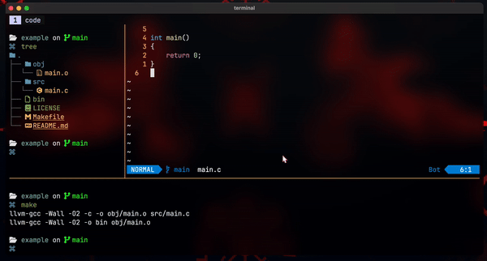

# only-tmux.nvim

## Description
You probably use
[vim-tmux-navigator](https://github.com/christoomey/vim-tmux-navigator) and
wonder if you could further blur the line between tmux and nvim panes. With this
plugin you can, by extending `:only` to act on tmux panes in your current
window as well.

With a single keybind you minimise all unfocused nvim windows to buffers and
either close the surrounding tmux panes, move them to a new tmux window, or
zoom the current tmux pane for a fully focused workspace.



## Installation and Setup
Install using your favourite plugin manager. For example, using
[lazy.nvim](https://github.com/folke/lazy.nvim):
```lua
{  'karshPrime/only-tmux.nvim',
    event = 'VeryLazy',
    opts = { new_window_name = "session" }, -- optional
},
```

## Actions
| Action  | Behaviour                                                         |
|---------|-------------------------------------------------------------------|
| `close` | `:only` in nvim and kill every other tmux pane in the window      |
| `move`  | `:only` in nvim and break other tmux panes out into a new window  |
| `zoom`  | `:only` in nvim and zoom the current tmux pane to fill the window |

The `zoom` action mirrors tmux's own `resize-pane -Z`: pressing it again from a
zoomed state is a no-op, so the same key reliably gives you a focused view.
Unzoom with your usual tmux binding (default `prefix z`).

## Keybinds

```lua
-- minimise nvim windows and close every other tmux pane
vim.keymap.set('n', '<leader>o', '<cmd>TMUXonly close<CR>', { silent = true })

-- minimise nvim windows and move other tmux panes to a new window
vim.keymap.set('n', '<leader>O', '<cmd>TMUXonly move<CR>',  { silent = true })

-- minimise nvim windows and zoom the current tmux pane
vim.keymap.set('n', '<leader>z', '<cmd>TMUXonly zoom<CR>',  { silent = true })
```
